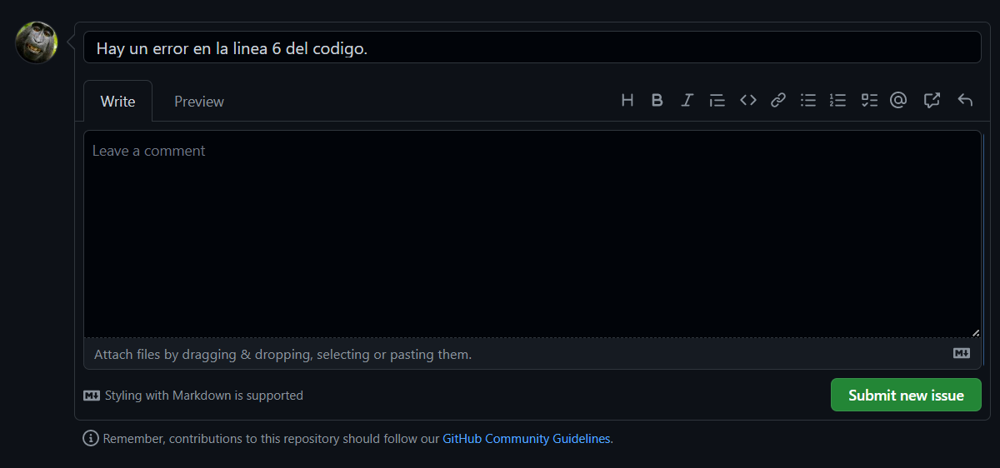
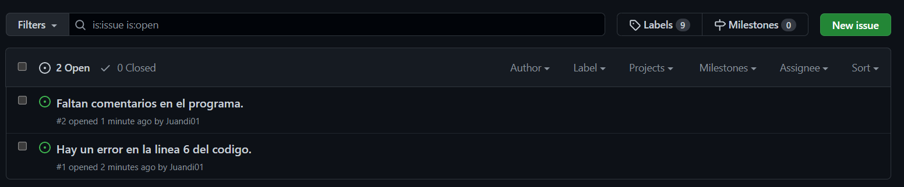
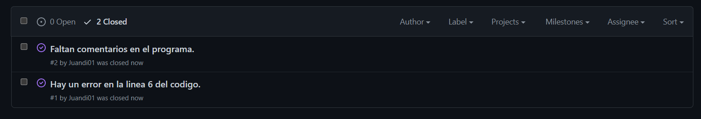

1. Me creare un par de issues. Al menos uno de ellos referenciando una línea de código y el otro que hay que añadir documentación
   
2. Etiqueta los issues con la etiquetas etiquetas que vienen por defecto
   
3. Cierra los issues abiertos de tu compañero desde el mensaje del commit donde lo soluciones en línea de comandos.
   
